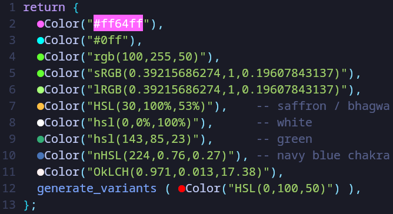

# colordot.nvim

Instant, lightweight inline color previews for Neovim.

`colordot.nvim` displays a colored **⬤** beside recognized color expressions using virtual text, while leaving the original source text and its normal syntax highlighting untouched.

The goal is simple:

> **Show the color separately. Don't color the code text.**

---

## Features

- Instant inline color preview with a colored dot (`⬤`)
- Keeps source text readable and normally highlighted
- Supports multiple color-expression formats
- Uses Neovim extmarks and virtual text
- Lexer → parser → color engine → decorator architecture
- Shared color conversion through [`colorlib`](https://github.com/SayanShankhari/colorlib)
- Lightweight and focused on one task
- Designed for fast startup and responsive editing

---

## Why Colordot?

Many color preview tools modify the foreground or background of the actual color expression.

Colordot takes a different approach: instead of taking known raw inputs it searches for non-breaking pattern that starts with `Color(` annd ends with `)` and no-breks inside, then the inside string is considered as the color-expression.

```lua
return {
  c1 = Color("#ff64ff"),
  c2 = Color("#0ff"),
  c3 = Color("rgb(100,255,50)"),
  c4 = Color("sRGB(0.39215686274,1,0.19607843137)"),
  c5 = Color("lRGB(0.39215686274,1,0.19607843137)"),
  c6 = Color("HSL(30,100%,53%)"),    -- saffron / bhagwa
  c7 = Color("hsl(0,0%,100%)"),    -- white
  c8 = Color("hsl(143,85,23)"),      -- green
  c9 = Color("nHSL(224,0.76,0.27)"), -- navy blue chakra
  c0 = Color("OkLCH(0.971,0.013,17.38)"),
  r  = generate_variants ( Color("HSL(0,100,50)") ),
};
```



The expression remains readable, while the colored dot provides the visual representation.

The `⬤` is intentionally fixed, means will not be changed to rectangular blocks or any other unicode characters (`●`, `◆`, `◉`, `▌`, `█`, `■`) and forms part of Colordot's visual identity.

---

## Architecture

Colordot separates discovery, interpretation, conversion, and rendering.

```text
                         ┌─────────────┐
                         │   Buffer    │
                         └──────┬──────┘
                                │
                                ▼
                         ┌─────────────┐
                         │   Scanner   │
                         └──────┬──────┘
                                │
                                ▼
                         ┌─────────────┐
                         │    Lexer    │
                         └──────┬──────┘
                                │
                           candidates
                                │
                                ▼
                         ┌─────────────┐
                         │   Parser    │
                         └──────┬──────┘
                                │
                        recognized color
                                │
                                ▼
                         ┌─────────────┐
                         │  colorlib   │
                         └──────┬──────┘
                                │
                             hex/RGB
                                │
                                ▼
                         ┌─────────────┐
                         │  Decorator  │
                         └──────┬──────┘
                                │
                                ▼
                               ⬤
```

### Scanner

Coordinates scanning of buffer lines and passes candidate lexemes through the lexer and parser.

### Lexer

Performs lexical analysis.

The lexer does not decide whether something is a valid color. It extracts continuous candidate expressions and records their source position.

### Parser

Determines whether a candidate represents a supported color format and produces a normalized color representation.

For example:

```text
rgb(100,255,50)
        ↓
RGB_COLOR
        ↓
#64FF32
```

### colorlib project

Handles the actual color interpretation and conversion mathematics.

Colordot treats `colorlib` as its color-engine dependency rather than implementing every color-space conversion itself.

### Decorator

Uses the parsed color to create or reuse a highlight group and places the colored `⬤` using an extmark.

---

## Installation

Using Neovim's built-in package manager:

```lua
vim.pack.add (
  {
    src = "https://github.com/SayanShankhari/colordot.nvim",
    name = "colordot",
  }
);
```

The plugin is loaded automatically through its `plugin/` entry point.

No lazy.nvim configuration is required.

Colordot initializes automatically when loaded. Does not wait to finish diagnostics.

## Quick Start

Open a buffer containing color expressions:

```lua
local colors = {
  Color("#ff6432"),
  Color("#0ff"),
  Color("rgb(100,255,50)"),
  Color("HSL(30,100%,53%)"),
  Color("nHSL(224,0.76,0.27)"),
}
```

Colordot displays:

```text
⬤ "#ff6432"
⬤ "#0ff"
⬤ "rgb(100,255,50)"
⬤ "HSL(30,100%,53%)"
⬤ "nHSL(224,0.76,0.27)"
```

The source text remains unchanged.

---

## Supported Expressions

Colordot is designed to accept compact, non-separated color expression.

Examples currently supported by the parser strictly include formats such as:

```text
#RGB
#RRGGBB
rgb(r,g,b)
sRGB(r,g,b)
lRGB(r,g,b)
HSL(h,s,l)
hsl(h,s,l)
nHSL(h,s,l)
```

The parser converts recognized expressions into a displayable color value, ultimately producing the value required by the decorator.

Support for additional formats continues to be added through the parser and color engine.

---

## Color Conversion

The parser does not need to know the mathematics of every color space.

A recognized expression follows this path:

```text
source lexeme
     ↓
recognized format
     ↓
colorlib
     ↓
normalized color
     ↓
hex/RGB representation
     ↓
highlight
```

For example:

```text
nHSL(224,0.76,0.27)
        ↓
    colorlib
        ↓
    RGB / sRGB
        ↓
    #......
        ↓
      ⬤
```

This allows Colordot to support additional color spaces without coupling the UI layer to their conversion algorithms.

---

## Source Text and Highlighting

Colordot deliberately does not recolor the actual source expression.

Instead, it uses:

- an extmark for the decoration
- virtual text for the `⬤`
- a dedicated highlight group for the dot
- a reset highlight for the source expression where necessary

This keeps the editor's normal syntax highlighting intact while providing a separate visual color indicator.

---

## Performance

Colordot is intentionally small and focused.

Its critical path is approximately:

```text
buffer change
    ↓
scan
    ↓
lex
    ↓
parse
    ↓
convert
    ↓
draw ⬤
```

There is no need to wait for an external language server or diagnostic pass to determine the displayed color.

The implementation also caches generated highlight groups so repeated colors can reuse the same Neovim highlight definition.

Performance optimizations such as incremental scanning, visible-line scanning, debouncing, or additional caching can be introduced when profiling demonstrates a real need.

---

## Project Structure

```text
colordot.nvim/
├── LICENSE
├── README.md
├── lua/
│   └── colordot/
│       ├── init.lua -- Public entry point and plugin lifecycle.
│       ├── scanner.lua -- Scans buffer contents and coordinates lexer/parser processing.
│       ├── lexer.lua -- Extracts candidate lexemes from source text.
│       ├── parser.lua -- Recognizes supported color formats and maps them to normalized color values.
│       ├── decorators.lua -- Places and manages virtual color dots through extmarks.
│       └── highlights.lua -- Creates and caches Neovim highlight groups for colors.
└── plugin/
    └── colordot.lua -- Neovim runtime entry point.
```

---

## Development

Clone the repository and add it to a local Neovim package/runtime path.

For example:

```bash
git clone https://github.com/SayanShankhari/colordot.nvim
```

During development, keep the plugin directly available to Neovim so source changes can be tested immediately.

A small sandbox configuration is useful for testing:

```text
neovim-sandbox/
├── init.lua
├── lua/
└── test/
    └── colors.lua
```

This makes it possible to test Colordot independently from a larger Neovim configuration.

---

## Extending Colordot

New color formats should follow the existing pipeline:

```text
Lexer
  ↓
Candidate
  ↓
Parser
  ↓
colorlib
  ↓
Normalized color
  ↓
Decorator
```

A new syntax should therefore normally require changes only to the lexer/parser and, when necessary, the shared color engine.

The decorator should not need to know whether the source expression was:

```text
#ff6432
rgb(100,255,50)
hsl(...)
oklch(...)
```

It only needs the resulting display color.

---

## Design Principles

### One task

Colordot focuses on one thing:

> Display colors next to color expressions.

### Don't recolor the code

The source remains readable and retains normal syntax highlighting.

### Separate interpretation from presentation

Parsing and color mathematics should not leak into the decoration layer.

### Reuse the color engine

Color-space conversion belongs to `colorlib`, not the Neovim UI layer.

### Optimize when necessary

Keep the implementation simple until profiling identifies an actual bottleneck.

---

## Roadmap

Planned expansion includes:

- additional hexadecimal formats
- RGB variants
- HSL variants
- perceptual color spaces
- additional color-space expressions supported by `colorlib`
- named colors
- further parser improvements
- incremental scanning and caching where beneficial

---

## Status

**Early development / actively evolving.**

The core architecture and instant virtual color preview are working. Supported formats and parser capabilities are still expanding.

---

## Related Projects

### colorlib

A standalone Lua color engine providing color models, conversions, operations, parsing, and related color mathematics.

[github.com/SayanShankhari/colorlib](https://github.com/SayanShankhari/colorlib)

### scotopia.nvim

A Neovim colorscheme project that also uses the shared `colorlib` color engine.

[github.com/SayanShankhari/scotopia.nvim](https://github.com/SayanShankhari/scotopia.nvim)

---

## License

[MIT](LICENSE)
